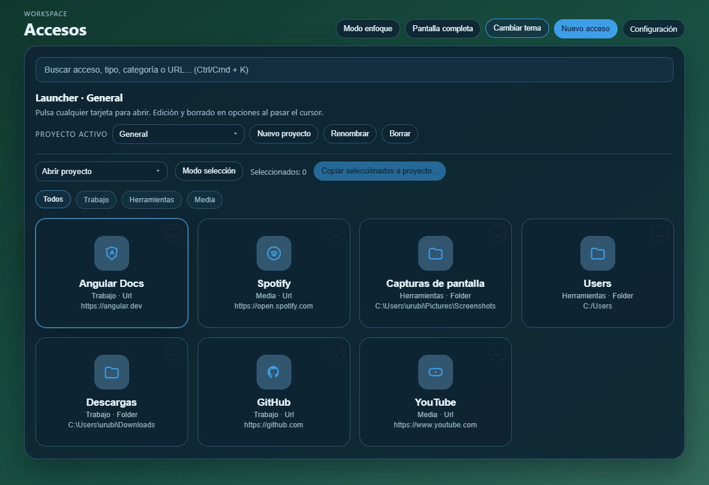
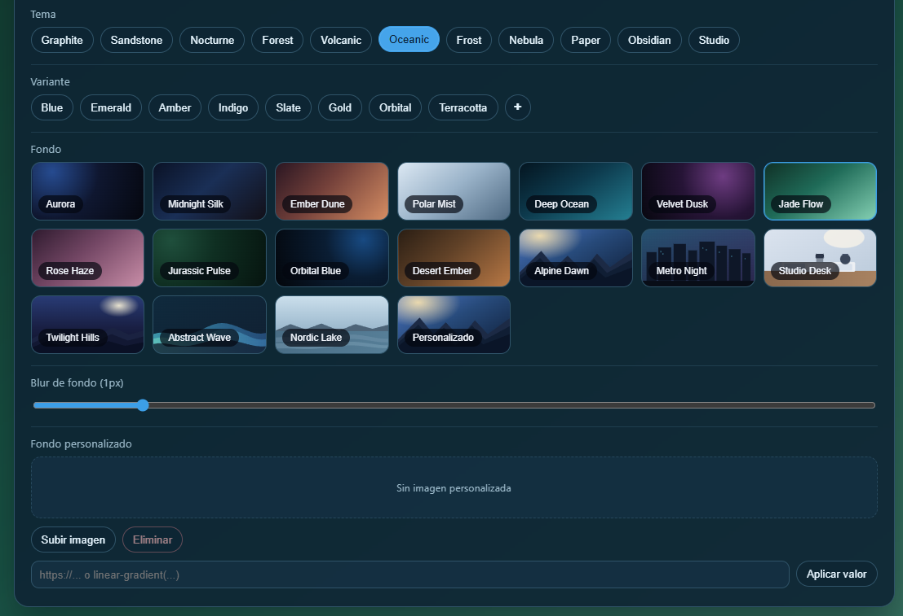
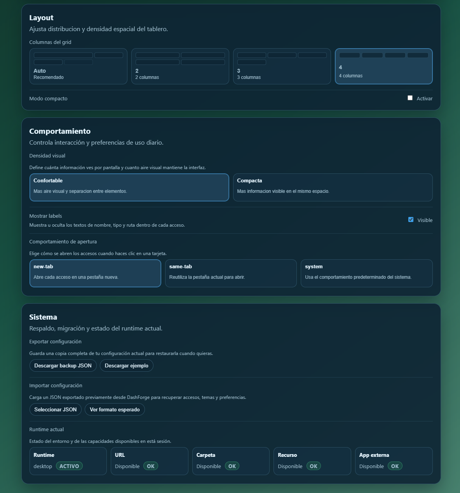

# 🚀 DashForge

<p align="center">
  
</p>

> DashForge es un launcher de escritorio que abre tu entorno de trabajo completo con un solo clic.


---

## ⚡ Quick Start

```bash
git clone https://github.com/Heitor077/DashForge
cd DashForge
npm install
npm run start:desktop
```

---

## 🧾 ¿Qué es DashForge?

DashForge resuelve un problema común: tener accesos importantes dispersos entre navegador, carpetas, archivos y aplicaciones, sin una capa clara de organización.

La aplicación centraliza esos accesos en un dashboard moderno, permite agruparlos por proyecto, configurar aperturas masivas y mantener un flujo rápido para el trabajo diario.

---

## 🎯 Objetivo del proyecto

DashForge nace como una herramienta personal para optimizar flujos de trabajo, evolucionando hacia un launcher modular enfocado a productividad real en entorno desktop.

---

## 📸 Preview





---

## ✨ Características principales

* Gestión de proyectos: crear, renombrar y eliminar
* Accesos agrupados por proyecto activo
* Selector de proyecto con dropdown custom
* Selección múltiple de accesos
* Copia individual y masiva entre proyectos
* Drag & drop para reordenar accesos
* Configuración por acceso (`includeInProjectLaunch`)
* Apertura por lote con control inteligente
* Persistencia local (sin base de datos)
* UI optimizada para velocidad y uso continuo

---

## ⚙️ Comportamiento inteligente

DashForge implementa un sistema de apertura progresiva adaptativa:

* Los accesos se abren de forma secuencial (no en paralelo)
* Se evalúa la memoria disponible del sistema en tiempo real
* Si hay pocos recursos, activa un modo seguro:

  * Reduce velocidad de apertura
  * Evita picos de CPU y RAM
* Feedback visual continuo del progreso

💡 Este sistema evita saturar el equipo al abrir múltiples aplicaciones, algo que la mayoría de launchers no resuelve.

---

## 🧠 Concepto del sistema

DashForge está centrado en proyectos:

* Cada proyecto contiene sus propios accesos
* El dashboard trabaja sobre un `activeProjectId`
* Los accesos pueden marcarse para apertura en lote
* Solo se ejecutan los seleccionados
* Las copias entre proyectos mantienen metadatos

---

## 💼 Caso de uso

Ejemplo real:

Un desarrollador puede configurar un proyecto con:

* Carpeta del proyecto
* VS Code
* Documentación
* Repositorio Git
* Herramientas externas

Con un solo clic, DashForge abre todo el entorno de trabajo de forma controlada y segura.

---

## 🏗 Arquitectura

Arquitectura Angular standalone con enfoque feature-based:

* `core/` → servicios globales y lógica
* `features/` → funcionalidades principales
* `shared/` → componentes reutilizables
* `electron/` → capa desktop (main + preload)

📄 Más detalles:
👉 [docs/architecture.md](docs/architecture.md)

---

## 📚 Documentación

- Arquitectura → [docs/architecture.md](docs/architecture.md)
- Contexto del proyecto → [docs/project-context.md](docs/project-context.md)
- Guías técnicas → [docs/agents/](docs/agents)

## 🛠 Tecnologías

* Angular 19 (standalone)
* Electron
* TypeScript
* HTML / CSS
* Angular CDK (drag & drop)
* electron-builder

---

## 📦 Instalación

```bash
npm install
```

---

## ▶️ Ejecución

### Desarrollo web

```bash
npm run start:web
```

### Desktop (Electron)

```bash
npm run start:desktop
```

---

## 🏗 Build

### Web

```bash
npm run build:web
```

### Desktop

```bash
npm run build:desktop
```

Salida:

* Web → `dist/`
* Desktop → `release/`

---

## 📁 Estructura del proyecto

```text
DashForge/
├─ electron/
├─ src/
│  ├─ app/
│  │  ├─ core/
│  │  ├─ features/
│  │  └─ shared/
│  ├─ index.html
│  └─ main.ts
├─ docs/
│  └─ architecture.md
├─ angular.json
└─ package.json
```

---

## 🚀 Roadmap

* [ ] Import/export de proyectos
* [ ] Onboarding inicial
* [ ] Mejora UX drag & drop
* [ ] Tests E2E
* [ ] Refinado branding final

---

## 💡 En qué se diferencia

DashForge no es un listado plano de enlaces:

* Organización por proyectos
* Apertura por lote configurable
* Sistema inteligente adaptado a recursos del sistema
* Flujo desktop-first con acceso a recursos locales
* UI optimizada para uso continuo

---

## 🧩 Estado del proyecto

Proyecto en desarrollo activo.

Actualmente enfocado en:

* estabilidad
* rendimiento
* experiencia de usuario desktop

Versión actual: **v1 (MVP funcional)**

---

## ⭐ ¿Por qué este proyecto?

DashForge nace como una solución real a un problema cotidiano de productividad.

No es un proyecto de demostración, sino una herramienta pensada para uso diario en entorno real.

---

## 👤 Autor

**Heitor Raga Lara**

---

## 🌐 Repositorio

https://github.com/Heitor077/DashForge
